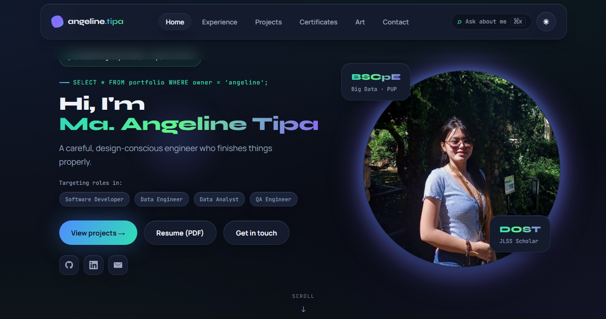

# Black Opal 💎

**My portfolio — a multi-page React site with a command console, an admin mode, and content that loads even when the database is asleep.**

**Live:** [opal-portfolio.vercel.app](https://opal-portfolio.vercel.app)



## What it is

A portfolio for **Ma. Angeline T. Tipa**, BS Computer Engineering (Big Data) at PUP Manila.

Two things made it worth building rather than using a template. First, I wanted to design the whole visual system myself — the claymorphism, the black-opal palette, the icons, all hand-built with no UI library and no icon package. Second, I wanted to be able to update my own content without redeploying, so there is a small admin mode behind auth.

The constraint I set for myself: the site must be complete and correct even if the backend is unavailable. Everything renders from files in `src/constants/` first, and the database only ever upgrades what is already on screen.

## How to try it

Open the [live link](https://opal-portfolio.vercel.app) and press **Ctrl + K** (or **⌘ + K**).

That opens the command console. Type a question — "what are her skills", "does she do testing", "when can she start" — and it answers from a local answer bank. No AI, no API call, no network request. Every answer is text I wrote, so it cannot invent anything or overstate a skill. It also jumps to any page if you type a page name.

The rest of the site is browsable without signing in. The `/admin` route exists but needs credentials.

## Features

- **Ask about me (Ctrl / Cmd + K)** — a command console answering questions about skills, projects and availability from a local, keyword-scored answer bank. Works offline, and can never hallucinate.
- **Admin mode** — sign in to add, edit, reorder and delete experience, projects, certificates, recognition and artwork, with image upload to Supabase Storage.
- **Recognition grouped by trait** — awards are grouped by what they demonstrate rather than what kind of award they were, with older school-level honors collapsed behind a toggle.
- **Graceful data fallback** — every page renders instantly from `src/constants/`, then upgrades to Supabase content if it exists. The site stays complete even when the database is asleep.
- **Dark and light themes**, scroll reveals, and a lightbox for certificates and artwork.
- **Hand-built design system** — plain CSS with design tokens, no framework, no component library, no icon package.

## Tech stack

| Part | What I use |
|---|---|
| Frontend | React 18, React Router, Vite |
| Backend | Supabase — Postgres, Auth, Storage, Row Level Security |
| Hosting | Vercel |
| Styling | Plain CSS with design tokens — no framework |

## How it works

### Seeds first, database second

```
src/constants/*.js  ──renders immediately──►  page
                                               ▲
Supabase  ──if reachable, within 3s────────────┘  (upgrade)
```

Every page starts from a seed file and swaps in database content only if the query returns something. This is the opposite of the usual pattern, where a page shows a spinner until the backend answers.

### Three decisions worth explaining

**A free-tier database pauses, so it cannot be on the critical path.** Supabase pauses inactive projects, and a paused project does not always fail fast — the request can simply hang. So `useCollection` and `useContent` race every query against a three-second timeout and keep the seed if it loses. A recruiter opening the site after months of inactivity sees a complete portfolio, not a spinner.

**The command console does not call an AI.** It scores a typed query against keyword lists and returns text from `src/constants/knowledge.js` — exact key match scores highest, then prefix, then substring. A language model would answer more fluently and would eventually invent a skill I do not have. On a page whose entire job is representing me accurately, the dumber system is the correct one.

**Awards are grouped by trait, not by type.** A writing award, a martial arts medal and a scholarship exam look unrelated in a flat list. Grouped as writing, discipline and rigor, each one becomes evidence of something a hiring manager cares about. Older school-level honors sit behind a toggle so the page leads with what is current.

## Data model

Supabase, all with Row Level Security. Public read, authenticated write.

| Table | Holds |
|---|---|
| `site_content` | Key/value documents — `profile`, `toolkit`, `education` |
| `experience` | Role, org, place, period, bullet points, tags |
| `projects` | Title, subtitle, category, description, tags, accent, image, live and repo URLs |
| `certificates` | Title, issuer, year, image |
| `recognition` | Title, detail, year, `group_name`, featured, earlier |
| `artworks` | Title, medium, image |

Collection tables are ordered by `sort_order`, then `created_at`.

**Note:** the recognition column is `group_name`, not `group` — `group` is reserved in SQL and breaks the table.

Image uploads go to a Supabase Storage bucket. Seed images are static files in `public/` so they survive a paused project.

## Project structure

```
opal-portfolio/
├── src/
│   ├── App.jsx                # routes + theme toggle
│   ├── pages/                 # Home, Experience, Projects, Certificates,
│   │                          # Gallery, Contact, Admin
│   ├── components/            # Navbar, Footer, Reveal, BrowserFrame,
│   │   │                      # CommandConsole, Recognition, Credentials,
│   │   │                      # SocialLinks, Splash, BgAmbient
│   │   └── admin/             # CollectionEditor, SettingsEditor, field inputs
│   ├── lib/
│   │   ├── supabase.js        # client (null when env vars are absent)
│   │   ├── useCollection.js   # table rows, seed fallback + 3s timeout
│   │   ├── useContent.js      # single documents, same guard
│   │   ├── auth.jsx           # admin session
│   │   └── mail.js            # mailto composer
│   └── constants/
│       ├── data.js            # profile, toolkit, education, projects,
│       │                      # certificates, artwork
│       ├── recognition.js     # awards, their groups, display helpers
│       ├── knowledge.js       # answer bank for the command console
│       └── adminSchema.js     # which fields each admin section shows
└── public/                    # profile photo, certificates, artwork, PDFs
```

## Run it locally

### 1. Install what you need

- **Node.js v18 or newer** — [nodejs.org](https://nodejs.org)
- **Git** — [git-scm.com](https://git-scm.com)

### 2. Get the code and start it

```bash
git clone https://github.com/angelinetipa/opal-portfolio.git
cd opal-portfolio
npm install
npm run dev
```

Open the printed link, usually `http://localhost:5173`.

**Supabase is optional here.** Without a `.env` the client is `null`, every hook keeps its seed, and the whole site renders from `src/constants/`. Only admin mode needs the backend.

### 3. Optional — connect Supabase

Create a `.env` in the project root:

```
VITE_SUPABASE_URL=...
VITE_SUPABASE_ANON_KEY=...
```

Both are safe to expose in the browser — access is controlled by row-level security, not by hiding the key.

### Build

```bash
npm run build     # production build
npm run preview   # serve the build locally
```

### Common problems

| Problem | Fix |
|---|---|
| Images 404 on Vercel but work locally | Filenames are case-sensitive on Vercel and not on Windows. Check the exact case |
| Admin page will not sign in | No `.env`, so the Supabase client is `null`. Add the two variables |
| Edited a seed file and nothing changed on the live site | That collection already has rows in the database, and the database wins. Edit through `/admin` instead |
| A page hangs on first load | Should not happen — the hooks time out at 3 seconds. If it does, check `src/lib/useCollection.js` |

## Edit or modify it

**Through admin** (preferred) — visit `/admin`, sign in, and edit any collection. Changes are live immediately.

**Through code** — the seed data lives in `src/constants/`:

| I want to change... | Edit this file |
|---|---|
| Name, tagline, about text, contact links, target roles | `profile` in `src/constants/data.js` |
| The toolkit chips | `toolkit` in `data.js` |
| Internships and their bullet points | `experience` in `data.js` |
| Project cards and descriptions | `projects` in `data.js` |
| Certificates and artwork | `certificates` / `artworks` in `data.js` |
| Awards, their groups, what shows on Home | `src/constants/recognition.js` |
| What the Ctrl+K console answers | `src/constants/knowledge.js` |
| Which fields the admin editor shows | `src/constants/adminSchema.js` |
| Colors, spacing, the clay effect | the CSS tokens in `src/index.css` |
| The seed-versus-database timeout | `TIMEOUT_MS` in `src/lib/useCollection.js` and `useContent.js` |

Static images go in `public/` and are referenced with a leading slash (`/certs/ccna.webp`).

**Important:** Supabase content **overrides** these seeds. Once a collection has rows in the database, editing the seed file changes nothing on the live site — but the seed is still what visitors see if the database is ever unreachable. So after editing through admin, mirror the change back into `src/constants/`. A stale seed is a silent way to show outdated content.

## Keeping the answer bank honest

`knowledge.js` is the one file that can misrepresent me, because it answers questions directly. Three rules:

- **Skill tiers mirror the CV exactly.** Proficient means proficient. Nothing gets promoted here without being promoted there.
- **Every answer must survive a follow-up question** in a real interview. If it cannot be defended out loud, it does not go in.
- **Where work was shared, say so.** Team projects name the team.

## Honest notes

**There are no tests.** No test runner, no CI. The scoring function in `knowledge.js` and the grouping helpers in `recognition.js` are pure functions and would be the obvious place to start — it is the gap I am least comfortable with, given testing is what I want to be hired for.

**Seeds and the database can drift.** Nothing enforces that they match. Editing through admin without mirroring the change back into `src/constants/` means a paused database quietly serves old content. A sync script, or a build-time check, would fix this properly.

**Admin is protected by Supabase Auth and RLS, not by hiding the route.** `/admin` is reachable by anyone; only the write policies stop them. That is the correct place for the check, but worth stating plainly.

**The command console is keyword matching, not understanding.** An unusual phrasing returns nothing. That is the accepted cost of an answer bank that cannot invent things.

## Credits

**Ma. Angeline T. Tipa** — BS Computer Engineering (Big Data), Polytechnic University of the Philippines – Manila

---

GitHub: [@angelinetipa](https://github.com/angelinetipa) · [opal-portfolio.vercel.app](https://opal-portfolio.vercel.app)